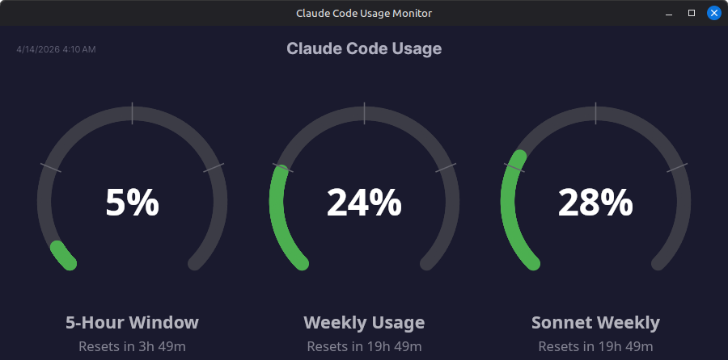

# Claude Code Usage Monitor

A small desktop app that shows your current Claude Code usage limits at a glance, logs every poll to disk, and visualizes the accumulated history as charts. It reads the OAuth credentials that Claude Code already stores on disk and polls Anthropic's usage endpoint once every two minutes.



## Features

### Gauges (main window)
- Live gauges for the 5-hour, weekly, weekly-Opus, and weekly-Sonnet usage windows
- Each gauge can be hidden via Settings; the window resizes to fit the visible count
- Countdown showing when each window resets
- Desktop notifications when a gauge crosses 70%, 80%, or 90%
- Optional minimize-to-tray with a tooltip summary of current utilization
- Right-click anywhere on the window for a context menu (Charts, Settings)

### Logging
- Optional TSV log files, one row per poll, with a column for every value returned (utilizations, reset times, extra-credit details, error)
- Daily rolling: each new day starts a new file (`Usage-YYYY-MM-DD.tsv`)
- Default output: `~/.claude/usage-logs/`; configurable to any directory via the Settings dialog
- A SQLite database at `~/.claude/usage-monitor.db` is always written (independent of the TSV toggle), and is the source for the charts

### Charts window
A separate window with seven tabs of historical visualizations:

1. **Burn Rate Forecast** — current weekly cycle plus a linear-fit projection from the last 24 hours, telling you when you'll hit 100% relative to the cycle reset.
2. **Hour-of-Day** — average growth in the 5-hour utilization bucketed by hour of local day. Shows when you actually do heavy work.
3. **Cycle Overlay** — every weekly cycle plotted as utilization vs. hours-since-cycle-start. Current cycle highlighted; lets you compare this week against prior weeks at a glance.
4. **Sonnet vs Opus** — current cycle's per-model utilization alongside the total weekly.
5. **Reset Waterfall** — final utilization at each cycle reset, one bar per cycle.
6. **Burst Detector** — 5-hour utilization rate-of-change over time, with bursts above 2× the median rate marked.
7. **Extra Credits** — progress bar showing pay-as-you-go credits used vs. monthly cap, with a daily-spend bar chart and pace forecast for the current calendar month.

Open the charts window from the tray menu or by right-clicking the main window.

### Other
- Automatic OAuth token refresh; rate-limit aware (backs off on 429)
- macOS Keychain support (reads `Claude Code-credentials` via Security.framework P/Invoke); Linux/Windows read the JSON file directly
- AOT-compiled binary

## How it works

The app reads Claude Code's OAuth credentials (from `~/.claude/.credentials.json` on Linux/Windows, or the macOS Keychain on Mac) and calls `https://api.anthropic.com/api/oauth/usage` on your behalf. On Linux/Windows, refreshed tokens are written back to the same file so Claude Code and the monitor stay in sync. No API key or separate login is required; if you're signed into Claude Code, the monitor works.

### Files written

- `~/.claude/usage-monitor-settings.json` — app settings (gauge visibility, logging toggle, log directory, minimize-to-tray)
- `~/.claude/usage-monitor.db` — SQLite history that powers the charts window
- `~/.claude/usage-logs/Usage-YYYY-MM-DD.tsv` — daily TSV log files (only if logging is enabled in Settings; the directory is configurable)

## Building

Built with .NET 10 and [Avalonia](https://avaloniaui.net/) 12. The project targets native AOT.

```bash
dotnet build
dotnet run
```

To publish a trimmed, AOT-compiled binary:

```bash
dotnet publish -c Release
```

A `claude-usage-monitor.desktop` file is included for Linux desktop integration; edit the `Exec`/`Icon` paths to match where you install the binary.

## Requirements

- An active Claude Code session (the monitor reuses its credentials)
- .NET 10 SDK to build from source
